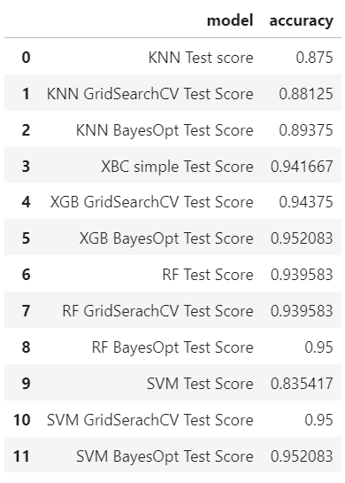

# ## # Final Capstone Project: Red wines classifacation and hyperparameter tunning with GridSearch and Bayesian Optimization

## NON-TECHNICAL Explanation of the project
In this project I focused on hyperparameter tunning usong GridSearch and Bayesian Optimization for classifiying red wines into three quality categories. The main goal was to compare the behaviour of KNN, XGBOOST, RandomForest and SVM classifier in a multiclass classifaction task a explore the practicall aspects of hyperparameter tunning especially via the Bayesian optimization. Tha practicall aspects were the programming  side, about to use libraries, parameters etc. , the duration of optimiation phases and of course the final result. **The jupyter notebook contains self-explanatory code**.

## DATA
The data was take from Kaggle site. More detail about it are in the [Dataset datasheet](https://github.com/Robert-Galiana-ml/Capstone-Final-Project-Imperial/blob/main/Dataset%20datasheet.md "Dataset datasheet")

## MODEL
Used classifier were:
- SVC (SVM based), KNN, and RandomForest from [scikit-learn](https://scikit-learn.org/stable/ "scikit-learn")
- XGB (gradient boosted tree ensemble) frpm [XGBoost Python Package](https://xgboost.readthedocs.io/en/stable/python/index.html "XGBoost Python Package")

For the GridSearch optimization I used [scikit-learn](https://scikit-learn.org/stable/ "scikit-learn") , for the Bayesian optimization I used [Bayesian Optimization package](https://pypi.org/project/bayesian-optimization/ "Bayesian Optimization package")

## RESULT
For all used classifiers train and test score are summarized in the tables below.

Scores on train set:

Scores on test set:

